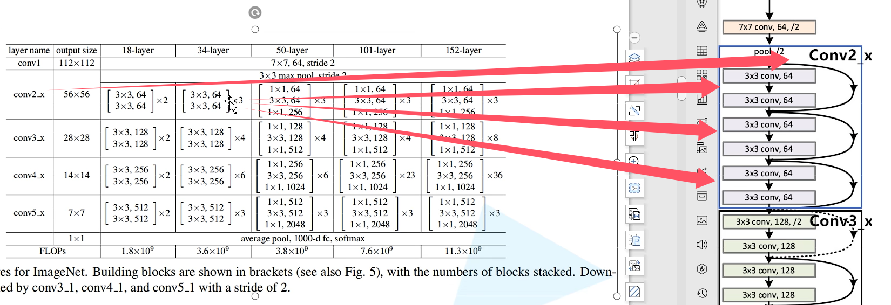

## ResNet

使用了残差块与BN层（若使用则不能使用偏执）


以上分别是不同resnet所对应的残差块，前一个对应更少的层数如resnet34，要区别两种残差块的方式是查看第一层的步长为几若为1则是直接进行残差，若为二则将进行1x1卷积核的换深度操作

第一幅图中表示resnet中的所有残差块从前一个残差块中传来的维度刚好是需要的，第二幅图则表示前一个残差块中传来的不是所需要的，所以使用1x1卷积核对其深度进行改造



```
if stride != 1 or self.in_channels != out_channels*block.expantion
```

34之前都是第一层是不需要虚线的，只有在跨残差时需要使用虚线（下采样）

50之后则每一层都会使用虚线

BasicBlock与Bottleneck中实现的只是如上图所示的一条实曲线所包裹的结构

ps:经过观察，输出大小与原大小关键在于：2 x 填充-卷积核大小

```
def __init__(self,
             block,
             blocks_num,
             num_classes=1000,
             include_top=True,
             groups=1,
             width_per_group=64)
```

block为所使用的残差块，blocks_num为每个残差块中的小块数量（如上图，[3,4,6,3]），include_top=True,
         groups=1, width_per_group=64为之后以resnet为基础扩展，


_make_layer（）函数用来定义每个残差块中的运算，其中包括了下采样实现，在resnet中通道数是固定的

```
def _make_layer(self, block, channel, block_num, stride=1)
```

block_num是残差块数目，以BasicBlock与Bottleneck为基本单位


循环套入残差块


由于每层输入通道数已经固定，并且可以看出最后的输出通道数一定是输入的四倍或一倍，由用哪个残差块决定，在 `BasicBlock` 中，输入和输出的通道数是相同的，因此它的 `expansion` 值设置为 1。Bottleneck输出的通道数是输入通道数的 4 倍。（意思是在一个残差块内的改变）
